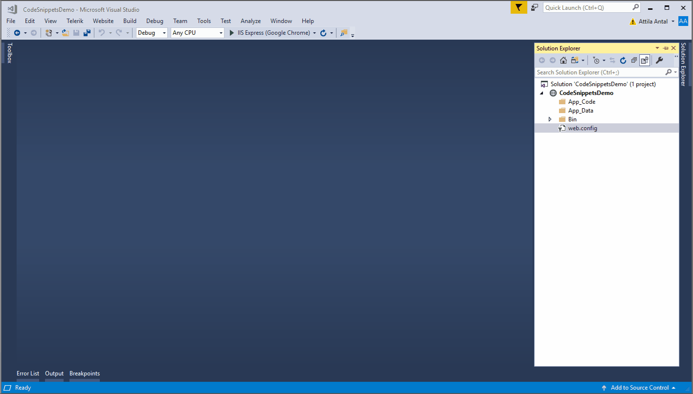

# RadGrid Excel-Like Filtering Demo

- Add a new Page to the Project
- Add RadScriptManager and RadAjaxManager controls to the Page using the `init` snippet for HTML
- Add RadGrid markup pre-configured for Excel-Like filtering to the page by using the `gridexcel` snippet for HTML
- In the code behind, generate the necessary methods required for RadGrid Excel-Like Filtering functionality using the `gridexcel` snippet for C#/VB. (it generates the NeedDataSource and FilterCheckListItemsRequested event handlers as well a DataTable data source with dummy data)

